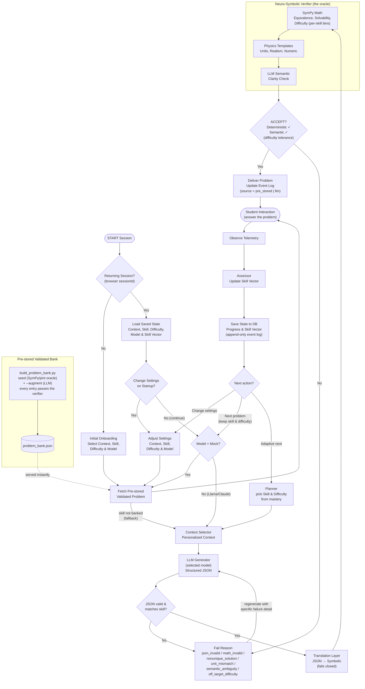

# System flowchart (as implemented)

This reflects the actual codebase: session lifecycle, the pre-stored validated
bank, model-driven generation, and the keep-settings vs. adaptive (Planner)
split. See `docs/architecture.md` for the prose version.

## What changed vs. the original flowchart

- **Model** is chosen at onboarding / settings, and it routes the "keep settings"
  path: **Mock → instant pre-stored**, **Llama/Claude → live LLM generation** at
  the chosen skill & difficulty.
- **Pre-stored bank** is an explicit source (`problem_bank.json`), built by
  `scripts/build_problem_bank.py` (deterministic seed + optional `--augment`);
  every entry is verifier-valid. Fetch falls back to the LLM loop if a skill
  isn't banked.
- **Two "next" paths**: *Next problem* keeps the user's skill/difficulty;
  *Adaptive next* hands skill & difficulty to the Planner.
- **JSON check** also enforces task↔skill consistency; **regeneration** feeds the
  *specific* failure detail (e.g. the verifier's computed answer) back to the model.
- **Difficulty** is binned per-skill with a configurable tolerance.
- Delivery records the **source** (`pre_stored` | `llm`) in the append-only log.
